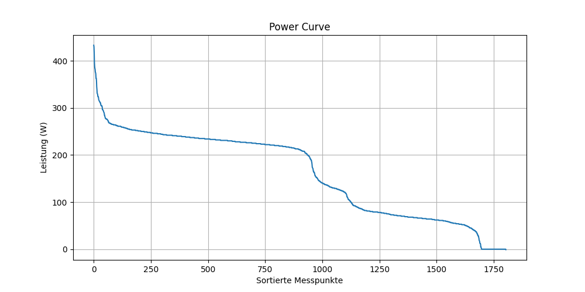

# Leistungskurve I

Dieses Projekt liest die Datei `activity.csv` ein, sortiert die Leistungswerte mit einem selbst programmierten Bubble-Sort-Algorithmus und erstellt eine Power-Curve-Grafik.

## Installation

pdm install

## Ausführung

pdm run python power_curve.py

## Ergebnis

